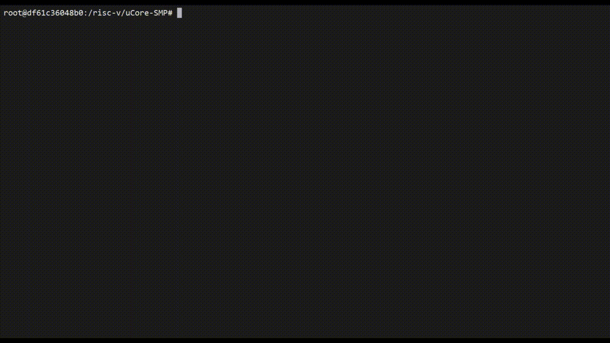

# uCore-SMP
A Symmetric Multiprocessing OS Kernel over RISC-V

# Supported Devices

- HiFive Unmatched (fu740)
- QEMU

# Documentation

[click here](doc/doc.pdf)

# Usage

## Running on HiFive Unmatched (fu740)

This version is only available on xiji gitlab. 

There are some versions that can pass the test, they are tagged as fu740-test-vXXX.

```shell
git clone https://gitlab.eduxiji.net/hlw2014/ucore-smp.git
cd uCore-SMP

# the fu740-test branch exists only on xiji gitlab, not on github
git checkout fu740-test
(or fu740-test-v0.5, fu740-test-v0.4 ...)

# this command will generate a kernel image called 'os.bin' in the root directory of the project, which can be loaded into memory via u-boot.
make all
```

## Running on QEMU

```shell
git clone https://github.com/NKU-EmbeddedSystem/uCore-SMP.git
(or https://gitlab.eduxiji.net/hlw2014/ucore-smp.git)

cd uCore-SMP

# QEMU version is on fu740 branch
git checkout fu740

# make user programs (e.g. shell)
make user

# make kernel
make

# run with QEMU
make run
```

# Run python3 on uCore-SMP

python3 package from [https://pkgs.alpinelinux.org/package/edge/main/riscv64/python3](https://pkgs.alpinelinux.org/package/edge/main/riscv64/python3)

we can run python3 scripts on uCore-SMP, here is a demo:




you can follow these steps to run python3 on uCore-SMP

1. checkout the `fu740-python` branch. 
2. download the python rootfs image from the release file list.
3. unzip the rootfs image and move it to ./user/riscv64-rootfs.img or write it to your sdcard.
4. run uCore-SMP on fu740 or QEMU according to the `Usage` section.


The test code is as follows.

```python
#!/usr/bin/python3

logo = '''
              _   _                 
  _ __  _   _| |_| |__   ___  _ __  
 | '_ \| | | | __| '_ \ / _ \| '_ \ 
 | |_) | |_| | |_| | | | (_) | | | |
 | .__/ \__, |\__|_| |_|\___/|_| |_|
 |_|    |___/                       
                          _                    
   ___  _ __         _ __(_)___  ___    __   __
  / _ \| '_ \       | '__| / __|/ __|____ \ / /
 | (_) | | | |      | |  | \__ \ (_______\ V / 
  \___/|_| |_|      |_|  |_|___/\___|     \_/  
                                               
'''

import json
import re


def print_bar(name):
	print('========', name, '========')


def json_decode_encode():
	data = {'a': 1, 'b': 2}
	s = json.dumps(data)
	restore_data = json.loads(s)
	print('dumps:', s)
	print('loads:', restore_data)


def hanoi(n, x, y, z):
	if n == 1:
		print(x, "->", z)
	else:
		hanoi(n - 1, x, z, y)
		print(x, "->", z)
		hanoi(n - 1, y, x, z)


def sort_random_list():
	l = [3, 10, 5, 3, 3, 4, 10, 10, 8, 0]
	print('before:', l)
	l.sort()
	print('after: ', l)


def re_test():
	line = "Cats are smarter than dogs"
	matchObj = re.match(r'(.*) are (.*?) .*', line, re.M | re.I)
	if matchObj:
		print("matchObj.group() : ", matchObj.group())
		print("matchObj.group(1) : ", matchObj.group(1))
		print("matchObj.group(2) : ", matchObj.group(2))
	else:
		print("No match!!")


if __name__ == '__main__':
	print(logo)
	print_bar('import test (json)')
	json_decode_encode()
	print_bar('recursion test (hanoi)')
	hanoi(3, 'x', 'y', 'z')
	print_bar('algorithm test (sort)')
	sort_random_list()
	print_bar('algorithm test (regular expression)')
	re_test()
```

